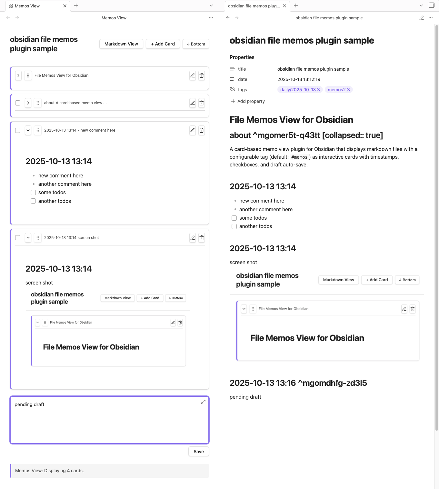

# File Memos View for Obsidian

A card-based memo view plugin for Obsidian that displays markdown files with a configurable tag (default: `#memos`) as interactive cards with timestamps, checkboxes, and draft auto-save.

## Screenshot



## Features

### Card-Based View
- Automatically displays files tagged with `#memos` (configurable) as interactive cards
- Each H2 heading becomes a separate card with its content
- Thino-style visual design for an elegant memo experience
- Toggle between Memos View and standard Markdown view

### Interactive Cards
- **Timestamps**: Each card displays creation time in the format `YYYY-MM-DD HH:mm`
- **Checkboxes**: Mark cards as complete/incomplete with checkbox toggles
- **Collapse/Expand**: Fold individual cards to reduce clutter
- **Drag & Drop**: Reorder cards by dragging the grip handle
- **Edit Mode**: Edit card content inline with rich markdown support
- **Delete Cards**: Remove cards with confirmation dialog

### Quick Add with Draft Auto-Save
- Quick input field at the bottom for adding new memos
- Automatic draft saving after 1 second of typing
- Draft cards are marked with `%%quickadd-draft%%` and excluded from view
- Convert draft to permanent card by clicking "Save"
- Empty drafts are automatically deleted

### Rich Markdown Support
- Full Obsidian markdown rendering
- Code blocks with syntax highlighting
- Task lists with interactive checkboxes
- Tables, blockquotes, and all standard markdown elements
- Image embeds and internal links
- Heading level adjustment to prevent draft block parsing issues

### Smart State Management
- Card collapse states persisted to both file and localStorage
- Checkbox states saved directly to markdown
- Real-time sync with external file changes
- Prevents reload during editing

### Settings
- **Memos Tag**: Customize the trigger tag (default: `memos`)
- **Use Frontmatter Title**: Display title from frontmatter instead of filename
- **Debug Logging**: Enable console debug logs for troubleshooting

## Usage

### Basic Usage
1. Create a markdown file and add `#memos` tag anywhere in the file (or in frontmatter)
2. Open the file - it will automatically display in Memos View
3. Add cards using the "Add Card" button or quick input at the bottom
4. Interact with cards: check, collapse, edit, reorder, or delete

### Markdown Format
```markdown
---
tags: [memos]
title: My Daily Notes
---

## 2025-10-13 14:30 ^abc123

First memo content here.
Can include **markdown** and more.

## 2025-10-13 15:45 [x] ^def456 [collapsed:: true]

Completed task memo with collapsed state.

## 2025-10-13 16:20 ^ghi789 %%quickadd-draft%%

This is a draft memo (won't show as card).
```

### File Structure
Each card is an H2 heading with:
- Timestamp in format `YYYY-MM-DD HH:mm`
- Optional checkbox: `[ ]` or `[x]`
- Block ID for tracking: `^blockid`
- Optional collapsed state: `[collapsed:: true]`
- Optional draft flag: `%%quickadd-draft%%`

## Installation

### Manual Installation
1. Download the latest release
2. Extract files to `VaultFolder/.obsidian/plugins/obsidian-file-memos/`
3. Reload Obsidian
4. Enable "File Memos View" in Settings → Community plugins

### Development
```bash
# Clone the repository
git clone https://github.com/yourusername/obsidian-file-memos-plugin.git

# Install dependencies
npm install

# Start dev mode with hot reload
npm run dev

# Build for production
npm run build

# Run tests
npm test
```

## Architecture

### Key Components
- **MemosView** (`src/MemosView.ts`): Main view component managing the card display
- **CardComponent** (`src/CardComponent.ts`): Individual card rendering and interactions
- **MarkdownParser** (`src/MarkdownParser.ts`): Parses markdown into block structures
- **EmbeddableMarkdownEditor** (`src/EmbeddableMarkdownEditor.ts`): CodeMirror-based editor component
- **main.ts**: Plugin entry point with settings and view registration

### Features Implemented
- [x] Tag-based view switching (`#memos`)
- [x] Card-based display with timestamps
- [x] Checkbox toggles for cards
- [x] Collapse/expand cards
- [x] Drag & drop reordering
- [x] Inline editing with markdown support
- [x] Quick add with draft auto-save
- [x] Delete cards with confirmation
- [x] State persistence (collapse states)
- [x] Settings panel
- [x] External file change detection
- [x] Rich markdown rendering (code, tables, images, links)
- [x] Heading level adjustment in drafts
- [x] Test coverage for core functionality

## Commands

- **Toggle Memos View**: Switch between Memos View and Markdown view

## Requirements

- Obsidian v0.15.0 or higher
- Node.js v16 or higher (for development)

## License

MIT

## Credits

Inspired by the Thino (formerly Memos) plugin's card-based interface.
